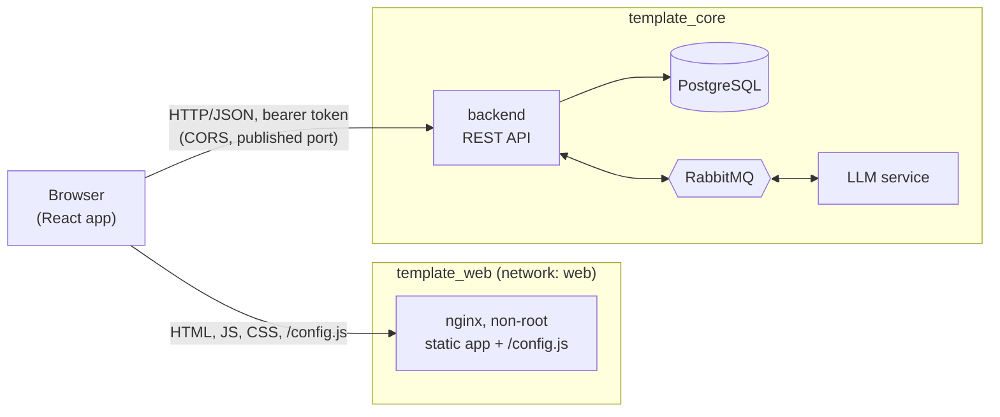

# template_web

## Overview

The frontend of the project skeleton: a small single-page app in React and TypeScript that
proves the backend in [template_core](https://github.com/yordan-gergov01/template_core) works.
It runs in its own container, knows the backend only by its URL, and talks only to the
backend's REST API.

## Prerequisites

- Docker with Compose v2, to build and run the frontend.
- A running [template_core](https://github.com/yordan-gergov01/template_core#readme): the app
  has nothing to show without its backend.
- Node.js 24 LTS (see `.nvmrc`), only for local development and for running the tests outside
  Docker.

## How to start

**template_core must be running first.** Start it as described in its
[README](https://github.com/yordan-gergov01/template_core#readme); its backend listens on
`http://localhost:8000` by default.

1. Create your environment file from the template:

   ```bash
   cp .env.example .env
   ```

2. Check the two values in `.env`:

   | Variable        | Default                 | Meaning                                                                                                                                                                                                 |
   | --------------- | ----------------------- | ------------------------------------------------------------------------------------------------------------------------------------------------------------------------------------------------------- |
   | `BACKEND_URL`   | `http://localhost:8000` | The backend as the browser reaches it: an http(s) origin without path, query or credentials. Written into `/config.js` when the container starts; the container refuses to start with an invalid value. |
   | `FRONTEND_PORT` | `3000`                  | Host port of the frontend. The origin `http://localhost:<port>` must be listed in template_core's `CORS_ALLOWED_ORIGINS` (default `http://localhost:3000`).                                             |

3. Build and start the frontend in the background:

   ```bash
   docker compose up -d
   ```

4. Check that it reports `healthy`, then open `http://localhost:3000`:

   ```bash
   docker compose ps
   ```

To stop it:

```bash
docker compose down
```

The backend URL is read when the container starts, so the same image serves every
environment: change `BACKEND_URL` and run `docker compose up -d` again, no rebuild needed. If
the page loads but every request fails, the backend is not running or its
`CORS_ALLOWED_ORIGINS` does not contain the frontend's origin.

### Local development

```bash
npm ci
npm run dev
```

The Vite dev server runs on `http://localhost:3000` (it refuses another port, because the
backend's CORS allows exactly this origin) and serves `/config.js` from `BACKEND_URL` in the
environment or `.env`, defaulting to `http://localhost:8000`. Stop the container first; both
use port 3000.

## Default login

The frontend has no accounts of its own. Log in with the admin account that template_core
creates on its first start from its `.env` (`ADMIN_USERNAME` and `ADMIN_PASSWORD`); with the
values from template_core's `.env.example` that is `admin` with the password
`dev-only-change-this-admin-password`. See template_core's
[Default login](https://github.com/yordan-gergov01/template_core#default-login).

To try the app as a plain user, create one on the **Users** screen with the role `user`, then
log in with it in another browser tab: each tab keeps its own session.

## How to run the tests

All checks run with one command, which must pass before every commit:

```bash
npm ci
npm run check
```

| Script                 | What it does                                                                                                      |
| ---------------------- | ----------------------------------------------------------------------------------------------------------------- |
| `npm run format:check` | Prettier, including the order of Tailwind classes (`npm run format` fixes it)                                     |
| `npm run lint`         | ESLint: strict type-checked rules, React hooks rules, the import boundaries between folders, and no inline styles |
| `npm run typecheck`    | TypeScript in strict mode                                                                                         |
| `npm test`             | Vitest unit tests                                                                                                 |

The unit tests cover the API client (headers, bodies, problem-details errors, 401 and 403
handling, aborts), the runtime configuration, the token storage and its expiry, the permission
helper, the query client's retry rules (mutations never retry), the long-polling loop (backoff,
`Retry-After`, cancelling), form error mapping and the input rules.

The API types are generated from the backend's OpenAPI document. With template_core running,
refresh them after a contract change and review the diff:

```bash
npm run api:snapshot
npm run api:types
```

## Architecture summary



**Place in the system.** The frontend container only serves static files. The browser loads
the app from it and then calls the backend directly; the backend is the only service the app
ever calls. The container joins only its own `web` network, never template_core's, so it has
no path to the LLM service, RabbitMQ or PostgreSQL, and it needs no connection to the backend
either.

**Runtime configuration.** `index.html` loads `/config.js` before the app. The container's
entrypoint writes it from `BACKEND_URL` at start (`window.__APP_CONFIG__ = { backendUrl }`) and
refuses to start on a missing or invalid value; the app validates it again. One image therefore
runs in every environment.

**Authentication and session.** The login form posts the username and password to
`POST /api/v1/auth/login`. The token and its expiry are kept in `sessionStorage`, so a reload
keeps the session and closing the tab ends it. Every request sends it as a bearer token. The
session ends 30 seconds before the token expires, on any 401 to a request that carried the
token, on logout (which ends every session of the user on the backend) and after a password
change; the user returns to the login page and, after logging in, to the page they wanted.

**Permissions in the UI.** After login the app loads `GET /api/v1/users/me`, including the
user's permissions. One helper, `can(permission)`, decides what is shown: navigation entries,
routes, and actions such as creating users or switching the model. Role names are never
checked. The backend remains the authority: a 403 is shown as "You are not allowed to do
this." and reloads the user's permissions, so a stale menu corrects itself.

**Long polling.** Sending a prompt returns 202 with a pending job. The page then calls
`GET /api/v1/prompts/{id}?wait_seconds=25` one request at a time until the job is completed or
failed, waits for `Retry-After` on a 429, backs off on network errors and 5xx answers, and stops
when the page is left. The answer is model output and is rendered as plain text only, together
with the model that produced it.

**Errors.** Backend errors are RFC 9457 problem details. Validation errors appear next to their
form fields; other errors show a readable message and the request ID, which finds the request in
the backend logs. A top-level error boundary replaces a blank page with a message.

**Code layout.** `src/` is organised by feature (`features/auth`, `profile`, `users`,
`prompts`, `llm-model`), each holding its components, hooks and API calls. Pages compose
features; shared code lives in `components/`, `hooks/`, `lib/` (API client, generated types,
query client), `utils/`, `config/` and `types/`; the session lives in `providers/auth/`.
ESLint enforces the import rules: features never import each other, and shared code never
depends on features, pages or routes. Server data goes through TanStack Query only. A new
screen is a feature folder for its components, hooks and API calls, a page that composes it,
and one entry in `PROTECTED_PAGES` in `src/routes/router.tsx`, which adds its route, its
permission guard and, with a label, its navigation link.

**Container and security headers.** A two-stage image: Node builds the app with `npm ci`, then
non-root nginx serves it. Both base images are pinned by digest. The container runs with a
read-only root filesystem, all capabilities dropped and `no-new-privileges`, and its health
check fetches `/index.html`. Every response carries a strict Content-Security-Policy (scripts,
styles and connections from its own origin only, plus API calls to the configured backend; no
inline scripts or styles), `X-Content-Type-Options: nosniff`, `Referrer-Policy: no-referrer`, a
minimal `Permissions-Policy` and `frame-ancestors 'none'`. Hashed assets are cached for a year;
`index.html` and `/config.js` are never served stale.

## Decisions

The choices this repository made where the brief was open, with their reasons, are in
[docs/DECISIONS.md](docs/DECISIONS.md). The backend's side is in template_core's
[README](https://github.com/yordan-gergov01/template_core#readme) and
[decision log](https://github.com/yordan-gergov01/template_core/blob/main/docs/DECISIONS.md).
